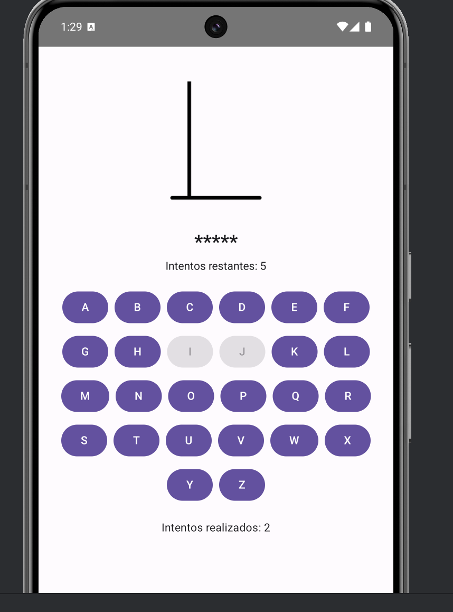
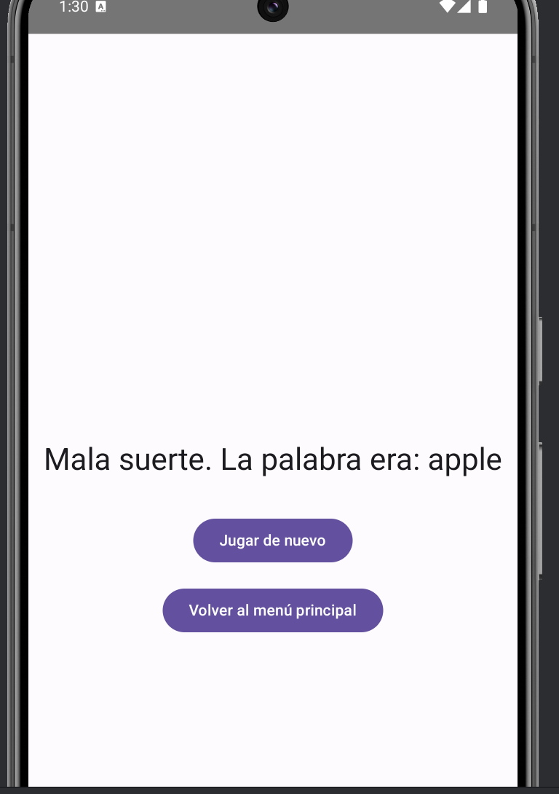

# PR04 Hangman App - Yago Alonso & Alex Vilanova

Este proyecto es un juego del ahorcado desarrollado con Jetpack Compose en Android. Permite a los usuarios jugar a adivinar palabras ocultas según diferentes niveles de dificultad.

---

## Menú Principal
El menú principal permite seleccionar el nivel de dificultad y acceder a las instrucciones del juego.

---

## Flujo del Programa

### Inicio del juego
El juego comienza mostrando una pantalla de carga con el logo del ahorcado.

### Selección de Dificultad
Se puede elegir entre tres niveles: Fácil, Normal, y Difícil.

### Pantalla de Juego
El jugador intenta adivinar la palabra seleccionando letras. Cada intento incorrecto acerca más al final del ahorcado.

### Resultado del Juego
Dependiendo del progreso del jugador:
- Si no acierta la palabra:
  
- Si acierta la palabra:
  
